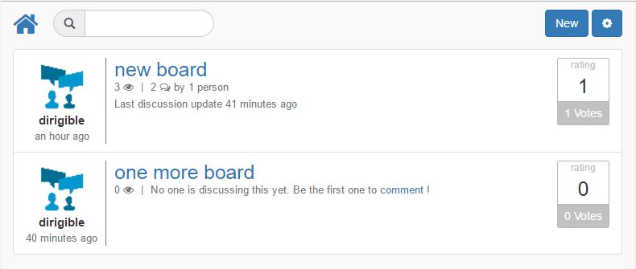
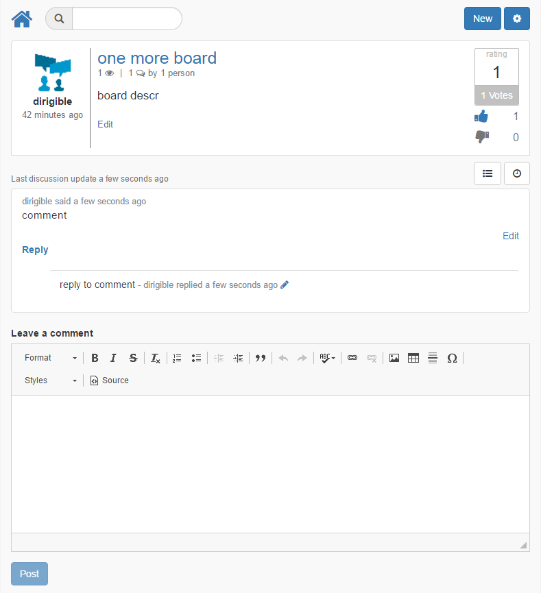
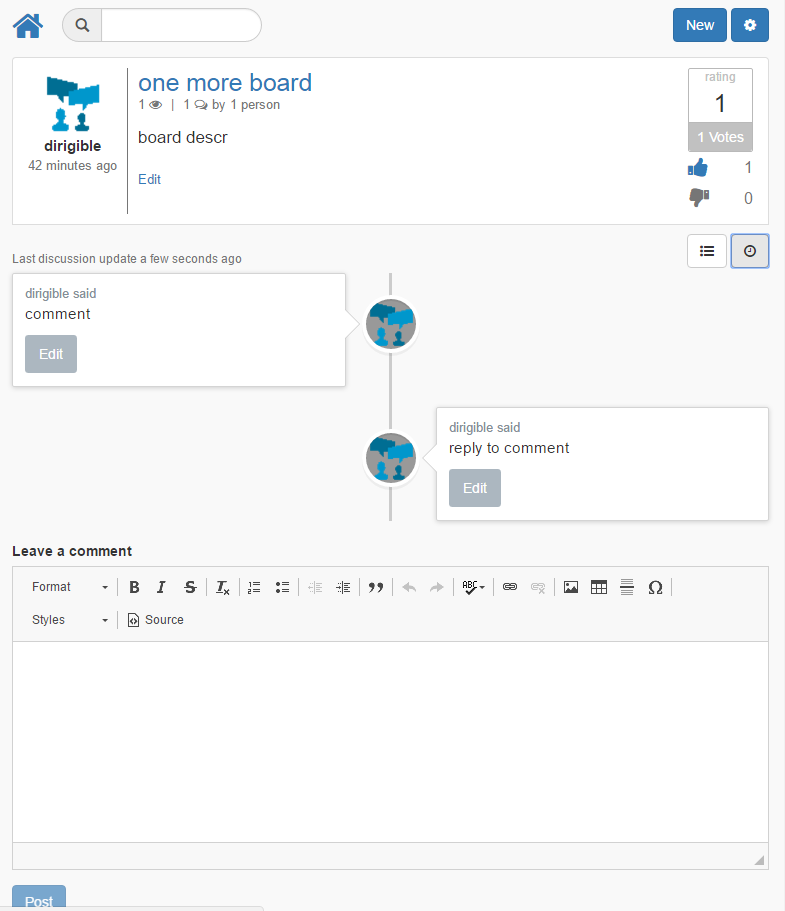

# Discussion Boards
Social, collaboration, discussion, you name it... this will get you started. 

Can list discussion boards:

Users can jump to details for activities such as review, vote, comment:

They can also swith to view the user discussion as a timeline

Note, that the boards and posts in the applications are related to the logged in user that has created them. In order to display  information about the user, such as an avatar, the application requries its username to be available in the USR_USER table of its dependencies. Currently it's not performed automatically and needs manual action.
